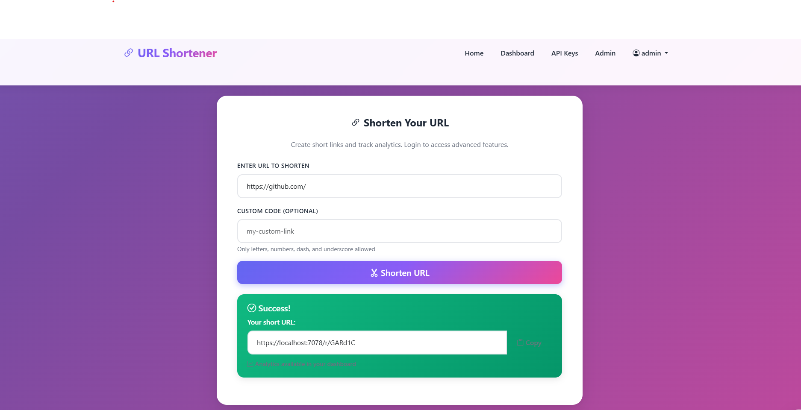
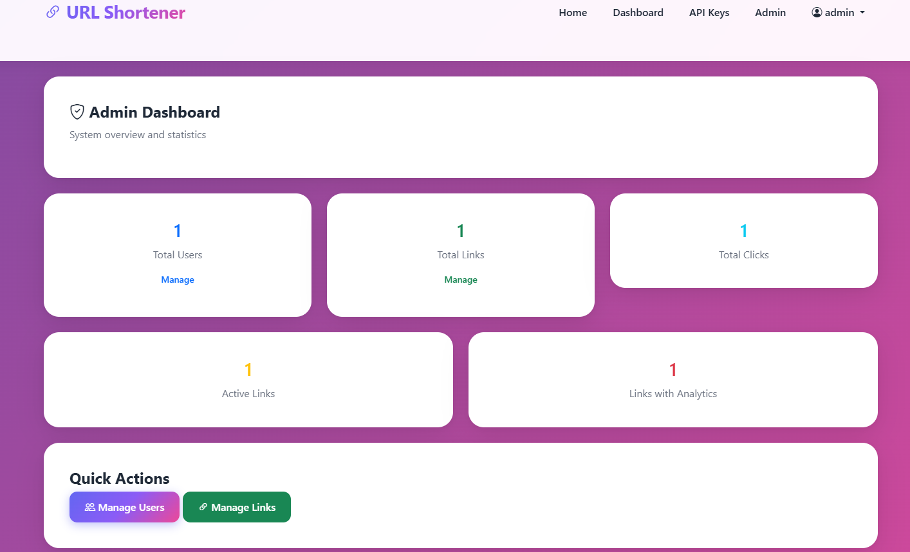
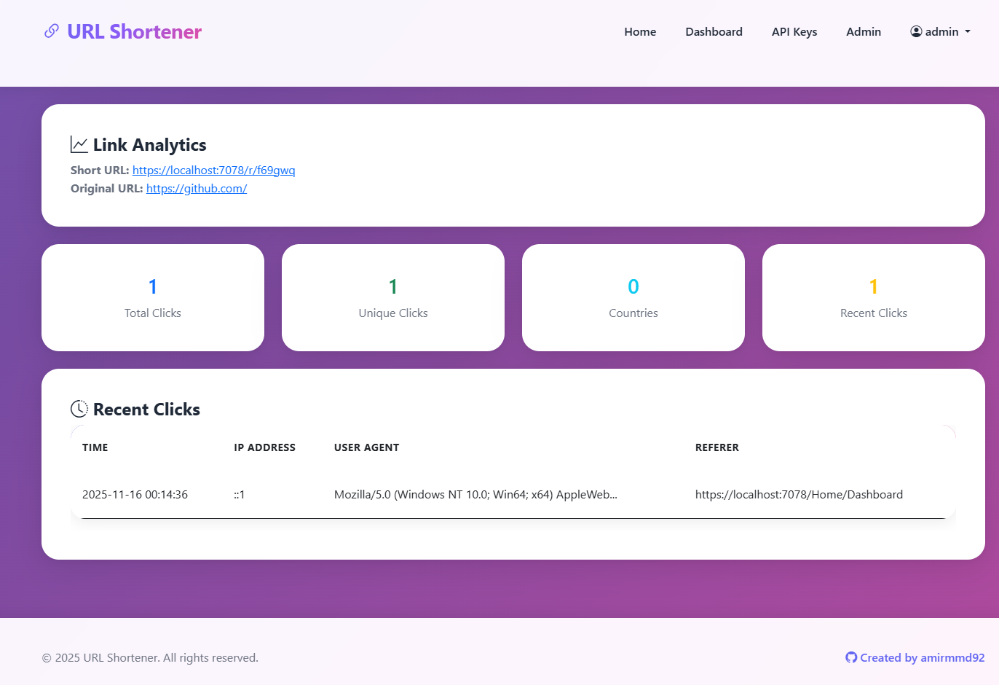
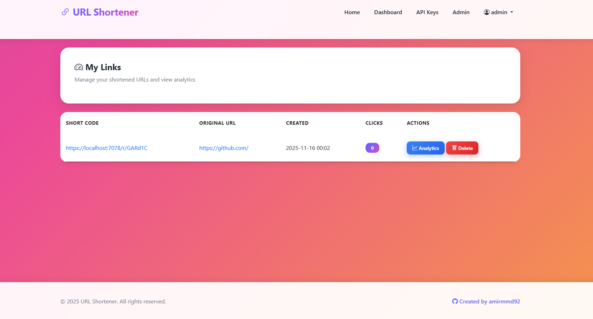
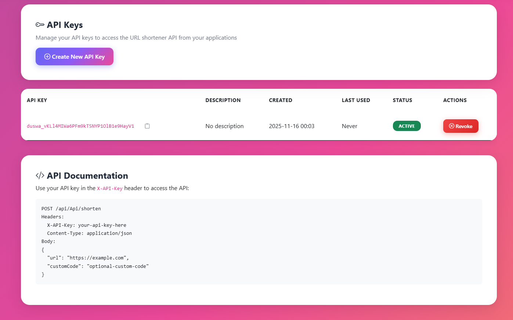

# Distributed URL Shortener with Analytics

A secure ASP.NET Core URL shortener application with analytics, API access, and admin panel.

## Screenshots

<style>
/* Container grid */
.gallery {
    display: grid;
    grid-template-columns: repeat(auto-fill, minmax(200px, 1fr));
    grid-auto-rows: 150px;
    gap: 5px; 
}


.gallery img {
    width: 100%;
    height: 100%;
    object-fit: cover; 
       display: block;
    transition: transform 0.3s ease, box-shadow 0.3s ease;
    cursor: pointer;
    border-radius: 8px; 
}


.gallery img:hover {
    transform: scale(1.05); 
    box-shadow: 0 8px 20px rgba(0,0,0,0.3); 
}
</style>

<div class="gallery">
    
    
    
    
    
</div>

## Features

- **URL Shortening**: Create short links with optional custom codes
- **Analytics**: Track clicks, IP addresses, user agents, and referrers (for logged-in users only)
- **API Access**: RESTful API with API key authentication
- **Admin Panel**: Manage users, links, and system statistics
- **Cookie Authentication**: Secure authentication with username/password
- **Auto Admin**: First registered user automatically becomes admin
- **Security**: Multiple security headers and best practices

## Requirements

- .NET 9.0 SDK
- SQL Server (with Windows Authentication for database connection)

## Configuration

1. Update the connection string in `appsettings.json`:
```json
{
  "ConnectionStrings": {
    "DefaultConnection": "Server=YOUR_SERVER\\SQLEXPRESS;Database=DUSWA;Trusted_Connection=True;TrustServerCertificate=True;MultipleActiveResultSets=true"
  },
  "BaseUrl": "https://localhost:5001"
}
```

2. Update `BaseUrl` to match your deployment URL.

## Database Setup

The database will be created automatically on first run using `EnsureCreated()`. For production, consider using migrations:

```bash
dotnet ef migrations add InitialCreate
dotnet ef database update
```

## Setting Up the First Admin User

**The first user who registers will automatically become an admin.** This feature is enabled by default and will only work once. After the first admin is created, this automatic assignment is disabled.

### Removing the Auto-Admin Feature (Optional)

After creating your first admin, if you want to remove this feature completely, you can delete the following:

1. **Delete the AppSettings model file:**
   - `Models/AppSettings.cs`

2. **Update `Data/ApplicationDbContext.cs`:**
   - Remove the line: `public DbSet<AppSettings> AppSettings { get; set; }`

3. **Update `Services/UserService.cs` in the `RegisterAsync` method:**
   - Remove lines 47-50 (the first admin check)
   - Remove lines 60 (the `IsAdmin` assignment logic)
   - Remove lines 67-78 (the AppSettings saving logic)
   - Change line 60 to: `IsAdmin = false,`

Here's the simplified `RegisterAsync` method after removal:

```csharp
public async Task<User?> RegisterAsync(string username, string email, string password)
{
    // ... validation code ...
    
    var user = new User
    {
        Username = username,
        Email = email,
        PasswordHash = passwordHash,
        IsAdmin = false,  // Simple assignment
        CreatedAt = DateTime.UtcNow
    };

    _context.Users.Add(user);
    await _context.SaveChangesAsync();
    return user;
}
```

**Note:** You can also simply keep the feature - it won't affect anything after the first admin is created since the check prevents it from running again.

To manually create additional admins, use the Admin Panel after logging in as the first admin.

## Usage

### Web Interface

- **Home Page** (`/`): Create short links (works without login)
- **Dashboard** (`/Home/Dashboard`): View and manage your links (requires login)
- **Analytics** (`/Home/Analytics/{id}`): View detailed analytics for a link (requires login and ownership)
- **API Keys** (`/Home/ApiKeys`): Manage your API keys (requires login)
- **Admin Panel** (`/admin`): System administration (requires admin role)

### API Usage

#### Create Short Link

```http
POST /api/Api/shorten
X-API-Key: your-api-key-here
Content-Type: application/json

{
  "url": "https://example.com",
  "customCode": "optional-custom-code"
}
```

#### Get User Links

```http
GET /api/Api/links
X-API-Key: your-api-key-here
```

#### Get Link Analytics

```http
GET /api/Api/analytics/{linkId}
X-API-Key: your-api-key-here
```

#### Delete Link

```http
DELETE /api/Api/links/{linkId}
X-API-Key: your-api-key-here
```

### Accessing Short Links

Short links are accessed via: `/r/{shortCode}`

The system automatically redirects to the original URL and tracks analytics (if the link was created by a logged-in user).

## Security Features

- Cookie-based Authentication with secure password hashing (BCrypt)
- API key authentication for API endpoints
- Security headers (X-Content-Type-Options, X-Frame-Options, X-XSS-Protection, etc.)
- HSTS enabled
- Input validation and SQL injection protection (via EF Core)
- Authorization checks for all sensitive operations
- Anti-forgery token protection

## Analytics

Analytics are only available for links created by logged-in users. Anonymous links cannot be tracked for privacy and security reasons.

Analytics include:
- Total clicks
- Unique clicks (by IP address)
- Clicks by country
- Recent clicks with IP, user agent, and referer
- Click timestamps

## Project Structure

```
├── Controllers/          # MVC controllers
│   ├── HomeController.cs
│   ├── ApiController.cs
│   ├── AdminController.cs
│   ├── RedirectController.cs
│   └── AccountController.cs
├── Models/              # Database models
│   ├── User.cs
│   ├── ShortLink.cs
│   ├── ClickAnalytics.cs
│   ├── ApiKey.cs
│   └── AppSettings.cs
├── Services/            # Business logic services
│   ├── UrlShortenerService.cs
│   ├── AnalyticsService.cs
│   ├── ApiKeyService.cs
│   └── UserService.cs
├── Data/                # Data access layer
│   └── ApplicationDbContext.cs
└── Views/               # Razor views
```

## License

This project is provided as-is for educational and development purposes.

